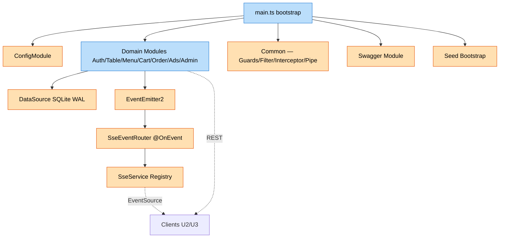

# U1 Backend — Logical Components (v2.2)

> **Stage**: CONSTRUCTION · U1 Backend · NFR Design Step 6 산출물 (2/2)
> **Inputs**: [`nfr-design-patterns.md`](nfr-design-patterns.md) · [`tech-stack-decisions.md`](../nfr-requirements/tech-stack-decisions.md) · [`components.md`](../../../inception/application-design/components.md)

본 문서는 U1 Backend의 **인프라/지원 컴포넌트 카탈로그**를 정의한다. 코드 패턴은 [`nfr-design-patterns.md`](nfr-design-patterns.md).

---

## 1. 컴포넌트 카탈로그

| 컴포넌트 | 종류 | 책임 | 주요 의존 | NFR 영향 |
|----------|------|------|-----------|----------|
| **DataSource (SQLite)** | Persistence | TypeORM DataSource + WAL/synchronous/foreign_keys PRAGMA | better-sqlite3, typeorm | NFR-7, NFR-12 |
| **In-memory SSE Channel Registry** | Real-time | `Map<sessionId, Subject>` + `Map<storeId, Subject>` + 15초 keep-alive | rxjs, EventEmitter2 | NFR-1, NFR-6 |
| **EventEmitter2 (NestJS)** | Event Bus | 도메인 ↔ SSE 디커플링 (`@OnEvent` listener) | @nestjs/event-emitter | NFR-10 |
| **JwtAuthGuard / passport-jwt Strategy** | Auth | JWT 검증 + payload 주입 | @nestjs/jwt, passport-jwt | NFR-2, NFR-3 |
| **QrTokenGuard** | Auth | SessionParticipant.token 조회 + revoked 거부 + session 메타 주입 | TypeORM | NFR-3, CR-1, CR-3 |
| **StoreScopeGuard / SessionScopeGuard** | Authorization | path↔user/session storeId/sessionId 일치 강제 | — | CR-1, NFR-7 |
| **RateLimitGuard** | Security | 로그인 endpoint — StoreUser.failedAttempts/lockUntil | TypeORM | NFR-3 |
| **HttpExceptionFilter** | Reliability | throw → `{ statusCode, message, errorCode }` 직렬화 + 500 catch-all 로그 | — | NFR-10 |
| **LoggingInterceptor** | Observability | 컨트롤러 entry/exit + duration ms + password redact | — | NFR-10 |
| **Global ValidationPipe** | Validation | class-validator + transform + whitelist + BusinessException(`VALIDATION_FAILED`) | class-validator | NFR-10 |
| **CORS Middleware** | Security | dev origin whitelist (`5173`, `5174`) | NestJS built-in | — |
| **Swagger Module** | Maintainability | `/api/docs` 자동 생성 | @nestjs/swagger | NFR-10 |
| **Seed Bootstrap Component** | Initialization | onModuleInit idempotent 시드 적재 | TypeORM | NFR-8 |
| **QR Image Service** | Utility | qrcode 라이브러리로 PNG/PDF 생성 | qrcode | — |
| **App Configuration (.env)** | Configuration | env 로드 + 검증 | @nestjs/config | — |

---

## 2. 컴포넌트 상세

### 2.1 DataSource (SQLite + WAL)

- 위치: `packages/backend/src/db/data-source.ts`
- 옵션:
  ```ts
  type: 'better-sqlite3',
  database: process.env.DB_PATH ?? './data/app.sqlite',
  synchronize: true,        // 워크샵 PoC
  prepareDatabase: (db) => {
    db.pragma('journal_mode = WAL');
    db.pragma('synchronous = NORMAL');
    db.pragma('foreign_keys = ON');
  },
  entities: [Store, StoreUser, Table, TableSession, SessionParticipant, Cart, CartItem, Order, OrderItem, OrderHistory, Menu, MenuCategory, Advertisement],
  logging: ['error', 'warn'],
  ```
- 라이프사이클: NestJS bootstrap 시 1회 init. shutdown hook으로 close.

### 2.2 SSE Channel Registry

- 위치: `packages/backend/src/modules/sse/sse.service.ts`
- 구조: 두 `Map<string, Subject<MessageEvent>>` + keep-alive Observable (15초 interval).
- 라이프사이클: 구독자 첫 진입 시 Subject 생성. 모든 구독자 unsubscribe 시 Subject complete + Map delete (옵션 — 메모리 leak 방지). NestJS shutdown 시 모든 Subject complete.
- 모니터링: 단순화로 메트릭 X (로컬 PoC).

### 2.3 EventEmitter2

- 위치: AppModule에 `EventEmitterModule.forRoot()` 등록.
- 사용: 도메인 service가 `eventBus.emit('order.created', payload)` → `SseEventRouter`의 `@OnEvent` listener가 채널 라우팅.
- 이벤트 카탈로그: `cart.updated`, `cart.cleared`, `order.created`, `order.deleted`, `session.started`, `session.closed`, `menu.soldout`, `menu.deleted` (옵션). 모두 동기 dispatch.

### 2.4 가드 5종

- 위치: `common/guards/`.
- 적용: 컨트롤러 또는 메서드 단위 `@UseGuards(...)`. AdminController는 글로벌 JwtAuthGuard+StoreScopeGuard, 고객 sessions/cart·orders는 QrTokenGuard+SessionScopeGuard. 세부는 [`nfr-design-patterns.md` §1.2](nfr-design-patterns.md#12-컨트롤러-적용).

### 2.5 Exception Filter / Logging Interceptor / ValidationPipe

- 모두 main.ts에서 `useGlobalFilters` / `useGlobalInterceptors` / `useGlobalPipes`로 등록.
- BusinessException → 400 + errorCode 통합 매핑 (Functional Design Q1).
- LoggingInterceptor: `password` 필드 자동 `***` masking.

### 2.6 CORS

- main.ts:
  ```ts
  app.enableCors({
    origin: (process.env.CORS_ORIGINS ?? 'http://localhost:5173,http://localhost:5174').split(','),
    credentials: false,
    methods: ['GET','POST','PATCH','DELETE','OPTIONS'],
    allowedHeaders: ['Content-Type','Authorization','X-Session-Token'],
  });
  ```

### 2.7 Swagger Module

- `/api/docs` — DocumentBuilder + SwaggerModule.setup.
- DTO 자동 schema 추출 (shared 패키지의 class-validator 데코레이션).
- Bearer / X-Session-Token 헤더 swagger UI에서 입력 가능.

### 2.8 Seed Bootstrap

- 위치: `packages/backend/src/seed/seed.service.ts`.
- 트리거: `pnpm --filter backend seed` (별도 CLI) + 옵션으로 `SeedModule.onModuleInit`(개발 자동 적재).
- 동작: 각 entity별 `findOne` → 없으면 INSERT (idempotent). 순서는 [`business-rules.md` §6](../functional-design/business-rules.md#6-시드-데이터-룰).

### 2.9 QR Image Service

- `qrcode` 라이브러리 + 메모리 PDF (pdfkit 또는 단순 PNG → 다운로드 응답).
- 매장 dashboard에서 신규 QR 발급 시 인쇄용 레이아웃(테이블 번호 + QR) 1페이지 PDF.

### 2.10 App Configuration

- `@nestjs/config` ConfigModule.forRoot.
- 필수 env: `JWT_SECRET`, `DB_PATH`, `CORS_ORIGINS`, `PORT`, `LOG_LEVEL`.
- bootstrap 시 누락 검증.

---

## 3. 컴포넌트 의존 그래프



---

## 4. 외부 인프라 컴포넌트 (없음)

본 PoC는 **외부 인프라 컴포넌트 0개**.

| 컴포넌트 | 상태 |
|----------|------|
| 메시지 큐 (Kafka/RabbitMQ) | 없음 — EventEmitter2 in-memory로 충분 |
| 캐시 (Redis/Memcached) | 없음 — NFR-8 로컬 한정 |
| Circuit Breaker | 없음 — 외부 의존 X |
| Service Mesh | 없음 — 단일 프로세스 |
| 별도 인증 서버 | 없음 — NestJS JWT 자체 |
| 메트릭 / APM | 없음 — 로컬 PoC |
| 별도 로그 수집기 | 없음 — 콘솔만 |

운영 환경 전환 시 위 항목 추가는 별도 단계.

---

## 5. 컴포넌트 ↔ NFR Traceability

| 컴포넌트 | 충족 NFR |
|----------|----------|
| DataSource (WAL) | NFR-12, NFR-1 |
| SSE Registry | NFR-1, NFR-6 |
| EventEmitter2 | NFR-10 (디커플링) |
| Guards (5종) | NFR-2, NFR-3, NFR-7, CR-1 |
| HttpExceptionFilter | NFR-10 |
| LoggingInterceptor | NFR-10 (관측·디버깅) |
| ValidationPipe | NFR-10 |
| CORS | (보안 보강 — Security Extension OFF지만 dev 기본) |
| Swagger | NFR-10 (개발자 usability) |
| Seed Bootstrap | NFR-8 |
| QR Image Service | UC-6, US-A3.1 |

---

## 6. 다음 단계

다음 **Code Generation (Part 1 Planning → Part 2 Generation)** 단계에서 본 문서·패턴을 바탕으로 실제 NestJS 모듈·서비스·컨트롤러·엔티티·DTO·테스트 코드를 생성한다.
