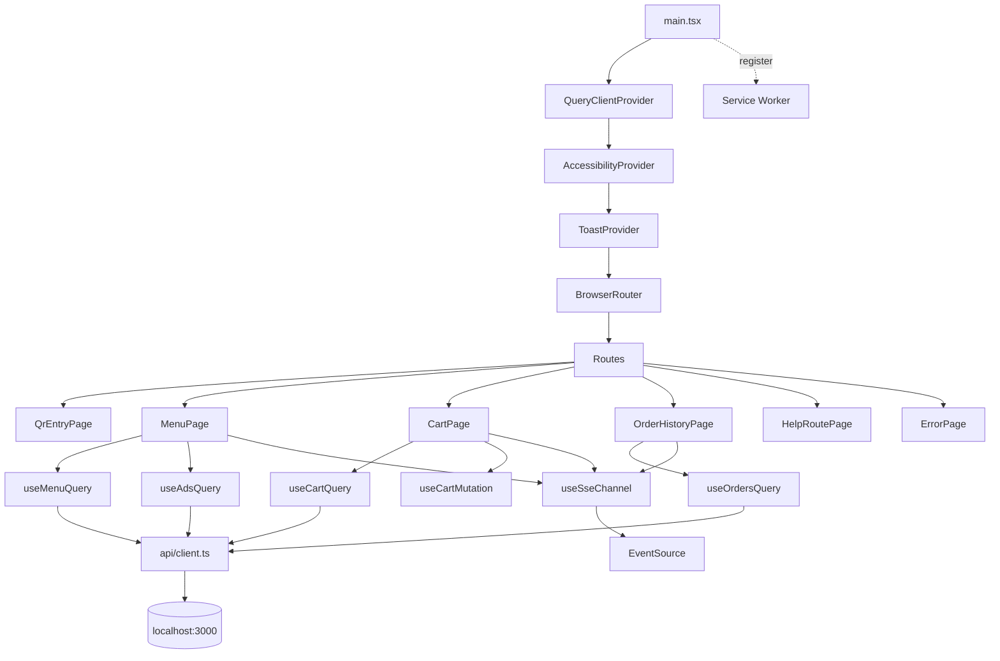

# U2 Customer Web — Logical Components (v2.2)

> **Stage**: CONSTRUCTION · U2 · NFR Design Step 6 산출물 (2/2)

---

## 1. 컴포넌트 카탈로그

| 컴포넌트 | 종류 | 책임 |
|----------|------|------|
| **Vite dev server** | Build/Run | HMR, proxy `/qr`·`/menus`·`/sessions`·`/ads`·`/sse`·`/admin` → backend:3000 |
| **vite-plugin-pwa** | PWA | manifest + workbox autoUpdate + service worker 등록 |
| **React Router** | Routing | BrowserRouter + RequireSession guard |
| **TanStack QueryClientProvider** | Data | 캐시 + mutations + invalidation |
| **AccessibilityProvider** | UX | largeText/highContrast Context + classList wiring |
| **ToastProvider** | UX | 전역 토스트 큐 (Context + useReducer) |
| **useSessionToken** | localStorage | 세션 토큰·메타 read/write/clear |
| **useSseChannel** | Real-time | EventSource + 이벤트 라우팅 + reconcile |
| **useHelp** | localStorage | 첫 진입 자동 + 헬프 버튼 |
| **API client (`api/client.ts`)** | HTTP | fetch wrapper + 헤더 + errorCode |
| **CSS 변수 토큰** | Styling | rem + font-scale + 색상 |

## 2. 외부 인프라 (없음)

- 백엔드 외부: 직접 호출 X. backend localhost:3000 통신만.
- CDN/이미지 호스팅: 광고 이미지는 시드 URL (외부) 또는 placeholder.
- 분석/모니터링: 없음 (로컬 PoC).

## 3. 의존 그래프

## 4. 컴포넌트 ↔ NFR

| 컴포넌트 | 충족 NFR |
|----------|----------|
| useSseChannel | NFR-1, NFR-6 |
| AccessibilityProvider | NFR-4, NFR-11, US-C0.2 |
| useSessionToken | NFR-5 |
| API client | CL-1, CL-2, CL-3 |
| TanStack Query | NFR-10 (mock 용이) |
| vite-plugin-pwa | NFR-11 (PWA 추가) |

## 5. 다음 단계

Code Generation에서 위 패턴·컴포넌트를 실제 React 코드로 생성. 워크샵 PoC라 핵심 페이지(MenuPage / CartPage / OrderHistoryPage / QrEntryPage / ErrorPage / HelpOverlay)만 우선 + 핵심 훅 7개 + API client.
