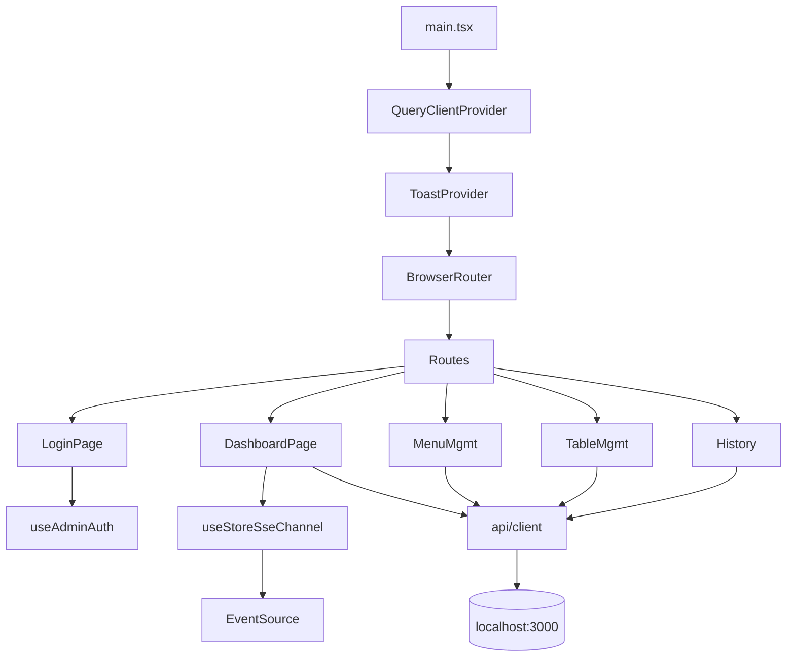

# U3 Admin Web — Logical Components (v2.2)

> **Stage**: CONSTRUCTION · U3 · NFR Design Step 6 산출물 (2/2)

---

## 1. 컴포넌트 카탈로그

| 컴포넌트 | 책임 |
|----------|------|
| Vite dev server | port 5174 + proxy backend:3000 |
| React Router | BrowserRouter + RequireAuth |
| QueryClientProvider | 캐시 4개(`['dashboard']`/`['menus']`/`['tables']`/`['history',…]`) |
| ToastProvider | 전역 토스트 큐 |
| useAdminAuth | JWT + 만료 비교 |
| API client | fetch + Bearer + ApiError + 401 처리 |
| useStoreSseChannel | 매장 채널 6 이벤트 |
| useQrDownload | Blob 다운로드 트리거 |
| CSS 변수 토큰 | 데스크톱 layout + 신규 강조 색 |

## 2. 외부 인프라 (없음)

## 3. 의존 그래프

## 4. NFR Traceability

- NFR-1·6 — useStoreSseChannel
- NFR-2·3 — useAdminAuth + API client
- NFR-10 — TanStack Query mock + RTL
- AL-7 — useQrDownload
