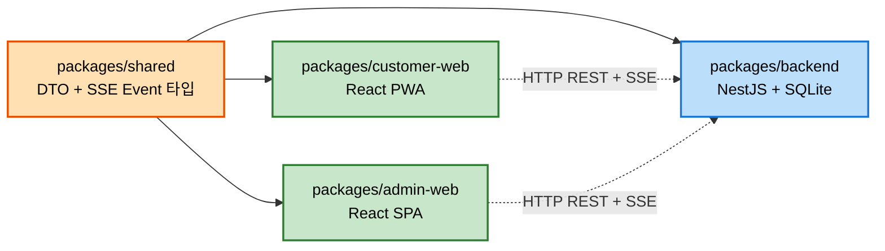
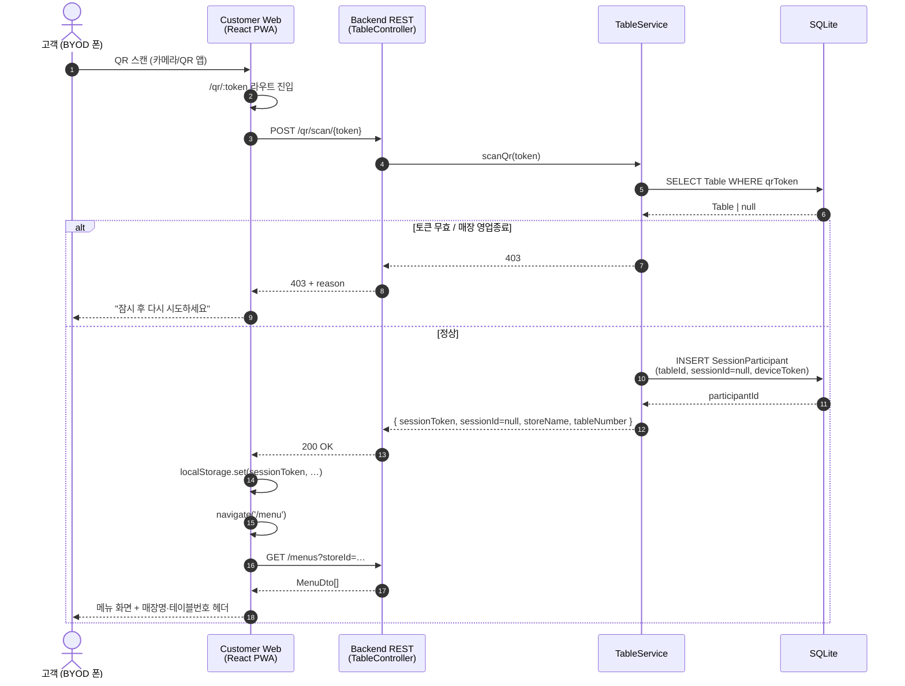
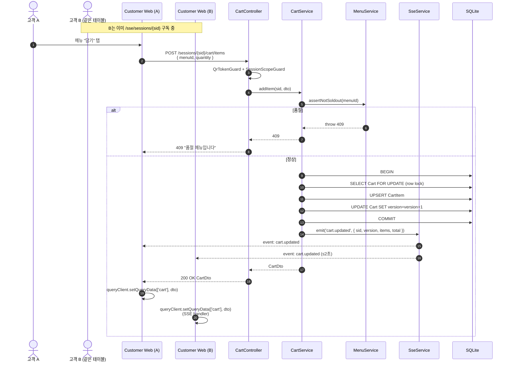
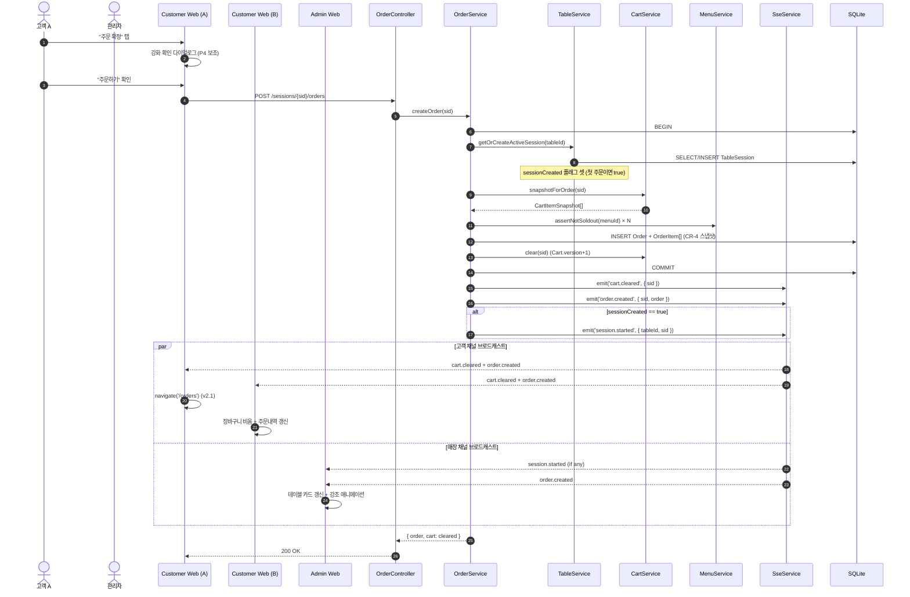
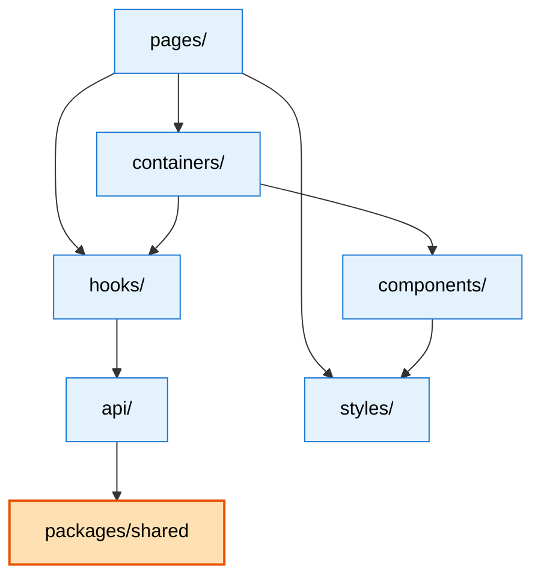

# Component Dependency — 테이블오더 서비스 (v2)

> **Stage**: INCEPTION · Application Design · Step 10 산출물 (4/4)
> **Inputs**: [`components.md`](components.md) · [`component-methods.md`](component-methods.md) · [`services.md`](services.md)

본 문서는 **컴포넌트 의존 매트릭스 + 통신 패턴 + 핵심 use-case 시퀀스 다이어그램 3개**를 다룬다.

---

## 1. 패키지·유닛 의존 (workspaces 레벨)



- `shared`는 frontend·backend 모두 import. 순환 의존 없음.
- frontend ↔ backend 간 직접 코드 의존 없음 — HTTP/SSE 프로토콜로만 연결.

---

## 2. Backend NestJS 모듈 의존 매트릭스

행이 열을 의존(import).

|              | Auth | Store | Table | Menu | Cart | Order | Sse | Ads | Admin | Common |
|--------------|:----:|:-----:|:-----:|:----:|:----:|:-----:|:---:|:---:|:-----:|:------:|
| **Auth**     |  —   |   ●   |       |      |      |       |     |     |       |   ●    |
| **Store**    |      |   —   |       |      |      |       |     |     |       |   ●    |
| **Table**    |      |   ●   |   —   |      |   ●  |   ●   |  ●  |     |       |   ●    |
| **Menu**     |      |   ●   |       |  —   |      |       |  ●  |     |       |   ●    |
| **Cart**     |      |   ●   |   ●   |   ●  |  —   |       |  ●  |     |       |   ●    |
| **Order**    |      |   ●   |   ●   |   ●  |   ●  |   —   |  ●  |     |       |   ●    |
| **Sse**      |      |       |       |      |      |       |  —  |     |       |   ●    |
| **Ads**      |      |   ●   |       |      |      |       |     |  —  |       |   ●    |
| **Admin**    |      |   ●   |   ●   |   ●  |   ●  |   ●   |  ●  |  ●  |   —   |   ●    |
| **Common**   |      |       |       |      |      |       |     |     |       |   —    |

**관찰**:

- `CommonModule`은 모든 모듈이 의존(가드·인터셉터·EventEmitter2 wiring 제공).
- `SseModule`은 `EventEmitter2`만 의존하고 도메인을 모름 — 역방향 의존(decoupled). 도메인 모듈이 SseService를 직접 호출하거나 EventEmitter로 emit.
- `OrderModule`이 가장 다인 협력자 (Table·Cart·Menu·Sse) — `createOrder()` 유스케이스 복잡도 반영.
- `AdminModule`은 read-only orchestrator라 거의 모든 도메인 의존하지만 쓰기는 안 함.
- **순환 의존 없음**: Table → Order? Order → Table은 OK. Table → Cart, Order → Cart도 OK. Cart는 Menu만 (단방향).

---

## 3. 통신 패턴 (Communication Patterns)

| 패턴 | 사용 위치 | 비고 |
|------|-----------|------|
| **HTTP REST (요청-응답)** | Customer Web → Backend, Admin Web → Backend | 모든 쓰기·읽기 표준. NestJS Swagger 자동 문서화. (Q2 결정) |
| **SSE (서버 → 클라이언트 푸시)** | Backend → Customer Web (`/sse/sessions/:sessionId`), Backend → Admin Web (`/sse/stores/:storeId`) | 단방향. NFR-1 ≤2초, NFR-6 SSE 전송. keep-alive 15초. |
| **DI (Backend 내부)** | NestJS 모듈 간 서비스 호출 | `@Injectable()` + 생성자 주입. `forwardRef`로 순환 회피(필요 시). |
| **EventEmitter2 (Backend 내부)** | 도메인 서비스 ↔ SseService | 도메인 → emit → SseService listener → 채널 라우팅. 결합도 ↓. |
| **localStorage (Frontend)** | useSessionToken, useAdminAuth, useAccessibility | 세션 토큰 + UI 설정만 (NFR-5) |
| **React Query 캐시 (Frontend)** | TanStack Query | SSE 수신 → setQueryData / invalidateQueries로 캐시 갱신 (Q5) |

### 3.1 클라이언트 → 서버 → SSE 브로드캐스트 흐름 (공통 패턴)

```text
Customer A 폰         Backend              Customer B 폰
   │                    │                     │
   │ POST /cart/items   │                     │
   ├───────────────────▶│                     │
   │                    │                     │
   │  (transaction)     │                     │
   │                    │                     │
   │  Cart version+1    │                     │
   │  SSE emit          │                     │
   │                    ├─── EventStream ────▶│ cart.updated
   │  200 OK CartDto    │     event           │ (≤2초)
   │◀───────────────────┤                     │
   │                    │                     │
```

- 모든 쓰기 경로가 동일 모양: REST 요청 → 트랜잭션 → 응답 + SSE 브로드캐스트.
- 요청자 본인도 SSE를 수신 (idempotent — 버전 체크로 중복 갱신 무해). 단, REST 응답이 먼저 도달하므로 본인 화면은 즉시 갱신.

---

## 4. 핵심 Use-Case 시퀀스 다이어그램 3개

### 4.1 시퀀스 1 — 고객 QR 스캔 입장 (US-C1.1)



**참고**: 세션은 아직 안 생긴 상태(첫 주문 시점에 생성). SessionParticipant.sessionId가 null이면 첫 주문 시 OrderService가 bind.

---

### 4.2 시퀀스 2 — 공동 장바구니 추가 + SSE 브로드캐스트 (US-C3.1)



**Note**: A의 POST 응답과 B의 SSE event는 거의 동시에 도착. 둘 다 `version`이 같으므로 idempotent. B의 React Query 캐시는 `setQueryData`로 즉시 갱신 → 화면 깜박임 없음.

---

### 4.3 시퀀스 3 — 주문 확정 + 관리자 대시보드 갱신 (US-C4.1 + US-A2.1)



**Note**: 관리자 대시보드는 별도 채널(`/sse/stores/:storeId`) 구독. 같은 도메인 이벤트가 세션 채널 + 매장 채널 양쪽에 동시 발화. 페이로드는 매장 채널이 `tableId` 추가로 풍부.

---

## 5. Frontend 모듈 의존 (Customer / Admin 공통 패턴)



- 단방향 의존 (Pages → Containers → Components → Styles, Containers → Hooks → API → Shared).
- 컴포넌트는 hooks를 직접 호출하지 않는다 (containers가 데이터 fetching 담당, components는 props만).

---

## 6. 의존 관계 요약

- **순환 의존 없음** (Backend·Frontend 양쪽).
- **공유 패키지 1개** (`shared`) — DTO + SSE 이벤트 타입 단일 진실 소스.
- **Cross-cutting 1개** (`CommonModule`) — 모든 도메인 모듈이 의존, 가드/인터셉터 제공.
- **이벤트 디커플링** — 도메인 서비스 ↔ SseService는 EventEmitter2 경유, 직접 의존 최소화.
- **클라이언트-서버 분리** — REST + SSE 프로토콜만 공유, 코드 의존 없음.
