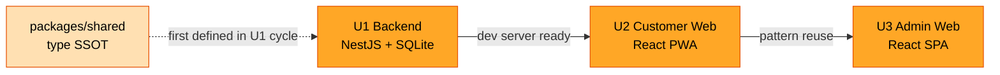

# Unit of Work — Dependency (v2.2)

> **Stage**: INCEPTION · Units Generation · Part 2 산출물 (2/3)
> **Inputs**: [`unit-of-work.md`](unit-of-work.md) · [`component-dependency.md`](component-dependency.md)

본 문서는 3 유닛 + shared 패키지의 **의존 매트릭스 · 통신 패턴 · 빌드/시드 순서**를 다룬다. 패키지·NestJS 모듈 단위 의존은 [`component-dependency.md`](component-dependency.md)에 이미 정의되어 있으므로, 본 문서는 **유닛 수준**만 표현한다.

---

## 1. 유닛 의존 매트릭스

행이 열을 의존한다 (`●` = 의존, `—` = 자기 자신, 빈 칸 = 의존 없음).

|        | U1 Backend | U2 Customer Web | U3 Admin Web | shared |
|--------|:----------:|:---------------:|:------------:|:------:|
| **U1 Backend**     |     —     |                 |              |   ●    |
| **U2 Customer Web**|    (RT)   |        —        |              |   ●    |
| **U3 Admin Web**   |    (RT)   |                 |       —      |   ●    |
| **shared**         |           |                 |              |   —    |

- `●` = **빌드 타임** 의존 (TypeScript import 또는 npm 의존).
- `(RT)` = **런타임만** 의존 (HTTP REST + SSE 프로토콜 호출). 빌드 타임엔 서로 모름.
- `shared`는 모두에 의존되지만 자신은 누구에도 의존하지 않는다 (type-only).
- **순환 의존 없음**.

---

## 2. 통신 패턴 (유닛 관점)

| 패턴 | 출발지 → 도착지 | 사용 위치 | 비고 |
|------|------------------|-----------|------|
| HTTP REST | U2 → U1 | 고객 REST 11 endpoint | NestJS Swagger UI 자동 문서화 |
| HTTP REST | U3 → U1 | 관리자 REST 16 endpoint | JWT 헤더 자동 부착 |
| SSE (서버 푸시) | U1 → U2 | `/sse/sessions/:sessionId` (세션 채널, 6 이벤트) | NFR-1 ≤2초, keep-alive 15초 |
| SSE (서버 푸시) | U1 → U3 | `/sse/stores/:storeId` (매장 채널, 5 이벤트) | 동상 |
| TS 타입 import | U1·U2·U3 → shared | DTO + SSE 이벤트 union 타입 | tsconfig path mapping |

런타임 통신은 모두 U1을 허브로 한다. **U2 ↔ U3 직접 통신은 없음** (Application Design §3 결정 그대로).

---

## 3. 빌드·실행 순서

### 3.1 최초 빌드 (cold start)

```text
1. pnpm install                       (workspace 전체 의존 설치)
2. pnpm --filter shared build         (Type-only이지만 tsc로 d.ts 생성)
3. pnpm --filter backend prisma 없음 → typeorm migration 또는 synchronize
4. pnpm --filter backend seed         (시드 데이터 — Store/User/Table/Menu/Ads)
5. pnpm --filter backend dev          (U1 dev 서버, port 3000)
6. pnpm --filter customer-web dev     (U2, port 5173)
7. pnpm --filter admin-web dev        (U3, port 5174)
```

- 2번이 빠지면 1, 4번 등이 shared 타입을 못 찾는다 → **shared가 빌드 1번 순위**.
- 4번 시드는 1회만. 이후 SQLite 파일이 남아 있으면 생략 가능.
- 5번이 켜져 있어야 6, 7번 fetch/SSE가 의미 있음.

### 3.2 CI/test 시 (참고)

```text
pnpm --filter shared build
pnpm --filter backend test            (단위 + e2e against in-memory SQLite)
pnpm --filter customer-web test        (RTL + MSW로 백엔드 mock)
pnpm --filter admin-web test
```

---

## 4. 코드 생성 순서 (Construction phase)

`unit-of-work-plan.md` Q2 답변 — **순차 U1 → U2 → U3**.



- U1 사이클 안에서 shared 패키지의 DTO/SSE 이벤트 union을 함께 정의 → U2·U3는 import만.
- 후속 유닛이 shared 갱신이 필요할 경우 mini-cycle로 shared 수정 후 U1 동기화.

---

## 5. 의존 관련 결정 사항 (v2.2 정합성 반영)

| 결정 | 출처 |
|------|------|
| **세션·Cart는 첫 스캔 시 동시 생성** (Cart 초기 version=0) | Application Design v2.2 |
| **테이블당 활성 TableSession 1개 unique** (DB 제약) | 동상 |
| **빈 세션을 관리자가 종료해도 OrderHistory 미기록** (movedOrders=0) | 동상 |
| **session.started SSE 발화 = 스캔 시점** (이전 v2.0 첫 주문 시점에서 변경) | 동상 |
| **/menus·/ads 가드** = 게스트는 QrTokenGuard 필요 (storeId는 세션에서 추출) | 동상 |
| **메뉴 삭제 시 카트에 포함되어 있으면 409** | 동상 |

이 모든 결정은 U1 Backend의 책임이지만 U2/U3 UI 동작 가정(빈 카트 진입·SSE 화면 갱신)도 의존한다. Functional Design에서 method body 룰로 G/W/T 정의.

---

## 6. 핵심 관찰

- **U1이 시스템의 컨트롤 허브**: 모든 쓰기·읽기·실시간 푸시의 단일 출처.
- **U2/U3는 대칭 구조**: 페이지/컨테이너/컴포넌트/훅 단방향 의존 + REST + SSE 구독. 다른 채널·다른 가드를 쓸 뿐.
- **shared는 type-only**: 런타임 로직 X, 빌드 타임 contract만. 코드 생성 양 적음 → 별도 유닛 아님 (Q1 결정 근거).
- **빌드 순서가 곧 코드 생성 순서**: shared → U1 → U2 → U3.
