# Execution Plan — 테이블오더 서비스 (v2 BYOD/QR)

> **Stage**: INCEPTION · Workflow Planning · Step 7 산출물
> **Prior context**: [`requirements.md` v2](../requirements/requirements.md) + [`stories.md` v2 (25 스토리)](../user-stories/stories.md) + [`personas.md` v2 (4 페르소나)](../user-stories/personas.md)
> **Project Type**: Greenfield · Workshop PoC · Local-only

---

## 1. Detailed Analysis Summary

### 1.1 Transformation Scope
Greenfield 프로젝트이므로 brownfield transformation 분석은 **N/A**. 신규 시스템 전체를 설계·구현.

### 1.2 Change Impact Assessment

| 영역 | 영향 | 비고 |
|------|------|------|
| User-facing changes | **Yes (full)** | 신규 고객 BYOD 모바일 웹 + 관리자 대시보드 — UI 전부 신규 |
| Structural changes | **Yes (full)** | NestJS API + React 클라이언트 2종 + SSE 채널 + SQLite DB — 시스템 전체 신규 |
| Data model changes | **Yes (full)** | Store / StoreUser / Table / TableSession / SessionParticipant / Cart / CartItem / Order / OrderItem / OrderHistory / Menu (soldout 포함) / Advertisement — 12개 엔티티 |
| API changes | **Yes (full)** | 매장 인증 / QR 검증 / 메뉴 / 공동 장바구니 / 주문 / 관리자 모니터링 / 메뉴·테이블·QR 관리 — REST + SSE |
| NFR impact | **High** | NFR-1 SSE ≤2초, NFR-3 bcrypt + 시도 제한, NFR-4 모바일 a11y, NFR-6 SSE 전송, NFR-11 반응형/PWA, NFR-12 공동 장바구니 last-write-wins |

### 1.3 Application Layer Impact
- **Code 신규**: NestJS 서비스(인증·메뉴·장바구니·주문·SSE·관리자·QR 발급) + React 컨테이너 2종(고객 PWA / 관리자 SPA)
- **Dependencies**: NestJS, TypeORM(or Prisma) + SQLite, JWT + bcrypt, sse 모듈, qrcode 생성, React 18, TanStack Query, vite, PWA manifest
- **Configuration**: `.env`(JWT secret·DB path·SSE keepalive 등), 시드 데이터(Store·Menu·Advertisement)
- **Testing**: NestJS e2e + Jest 단위 (PBT 미적용 — Q8 결정), React Testing Library

### 1.4 Infrastructure Layer Impact
- **Deployment model**: 없음. 로컬 단일 머신에서 `npm` 한 줄 기동 (NFR-8).
- **Networking / Storage / Scaling**: 모두 N/A (로컬 한정).

### 1.5 Operations Layer Impact
- **Monitoring / Logging / Alerting / CI-CD**: 모두 N/A — 워크샵 PoC, Operations 단계는 PLACEHOLDER.

### 1.6 Risk Assessment

| 항목 | 평가 | 근거 |
|------|------|------|
| Risk Level | **Medium** | 시스템 전체 신규 + SSE 동시성 + N참가자 합류 로직이라 단순 CRUD보다 까다로움. 단, 로컬·PoC라 운영 리스크는 없음. |
| Rollback Complexity | **Easy** | 코드 일괄 폐기 가능 (워크샵 산출물). git tag `v1-shared-tablet` 보존됨. |
| Testing Complexity | **Moderate** | SSE 동시성·세션 라이프사이클·QR 토큰 무효화 시나리오 mock 필요. |

---

## 2. Workflow Visualization

```mermaid
flowchart TD
    Start(["User Request"])

    subgraph INCEPTION["🔵 INCEPTION PHASE"]
        WD["Workspace Detection<br/><b>COMPLETED</b>"]
        RA["Requirements Analysis<br/><b>COMPLETED</b>"]
        US["User Stories<br/><b>COMPLETED</b>"]
        WP["Workflow Planning<br/><b>IN PROGRESS</b>"]
        AD["Application Design<br/><b>EXECUTE</b>"]
        UG["Units Generation<br/>(Planning + Generation)<br/><b>EXECUTE</b>"]
    end

    subgraph CONSTRUCTION["🟢 CONSTRUCTION PHASE"]
        FD["Functional Design (per-unit)<br/><b>EXECUTE</b>"]
        NFRA["NFR Requirements (per-unit)<br/><b>EXECUTE</b>"]
        NFRD["NFR Design (per-unit)<br/><b>EXECUTE</b>"]
        ID["Infrastructure Design (per-unit)<br/><b>SKIP</b>"]
        CG["Code Generation (per-unit)<br/>(Planning + Generation)<br/><b>EXECUTE</b>"]
        BT["Build and Test<br/><b>EXECUTE</b>"]
    end

    subgraph OPERATIONS["🟡 OPERATIONS PHASE"]
        OPS["Operations<br/><b>PLACEHOLDER</b>"]
    end

    Start --> WD
    WD --> RA
    RA --> US
    US --> WP
    WP --> AD
    AD --> UG
    UG --> FD
    FD --> NFRA
    NFRA --> NFRD
    NFRD --> ID
    ID --> CG
    CG --> BT
    BT --> OPS
    OPS --> End(["Complete"])

    style WD fill:#4CAF50,stroke:#1B5E20,stroke-width:3px,color:#fff
    style RA fill:#4CAF50,stroke:#1B5E20,stroke-width:3px,color:#fff
    style US fill:#4CAF50,stroke:#1B5E20,stroke-width:3px,color:#fff
    style WP fill:#FFA726,stroke:#E65100,stroke-width:3px,color:#000
    style AD fill:#FFA726,stroke:#E65100,stroke-width:3px,stroke-dasharray: 5 5,color:#000
    style UG fill:#FFA726,stroke:#E65100,stroke-width:3px,stroke-dasharray: 5 5,color:#000
    style FD fill:#FFA726,stroke:#E65100,stroke-width:3px,stroke-dasharray: 5 5,color:#000
    style NFRA fill:#FFA726,stroke:#E65100,stroke-width:3px,stroke-dasharray: 5 5,color:#000
    style NFRD fill:#FFA726,stroke:#E65100,stroke-width:3px,stroke-dasharray: 5 5,color:#000
    style ID fill:#BDBDBD,stroke:#424242,stroke-width:2px,stroke-dasharray: 5 5,color:#000
    style CG fill:#4CAF50,stroke:#1B5E20,stroke-width:3px,color:#fff
    style BT fill:#4CAF50,stroke:#1B5E20,stroke-width:3px,color:#fff
    style OPS fill:#FFF59D,stroke:#F57F17,stroke-width:2px,color:#000
    style Start fill:#CE93D8,stroke:#6A1B9A,stroke-width:3px,color:#000
    style End fill:#CE93D8,stroke:#6A1B9A,stroke-width:3px,color:#000

    linkStyle default stroke:#333,stroke-width:2px
```

---

## 3. Phases to Execute

### 🔵 INCEPTION PHASE

- [x] **Workspace Detection** — COMPLETED (greenfield 판정)
- [x] **Reverse Engineering** — SKIPPED (greenfield)
- [x] **Requirements Analysis** — COMPLETED (v2 Iteration 2, BYOD/QR/공동 장바구니/광고)
- [x] **User Stories** — COMPLETED (v2.1, 25 스토리, 4 페르소나)
- [x] **Workflow Planning** — IN PROGRESS (본 문서)
- [ ] **Application Design** — **EXECUTE**
  - **Rationale**: 신규 시스템 전체 — NestJS 모듈(Auth/Menu/Cart/Order/SSE/Admin) + React 컨테이너 2종 + 12개 엔티티 + 컴포넌트 간 의존(SSE 채널·세션 라이프사이클·QR 토큰 무효화) 명확화 필요.
- [ ] **Units Generation** — **EXECUTE**
  - **Rationale**: 단일 단위로 다루기엔 너무 큼. 백엔드·고객 클라이언트·관리자 클라이언트로 자연 분리. **3 유닛 권장** (워크샵 PoC라 잘게 쪼개지 않음).

### 🟢 CONSTRUCTION PHASE

- [ ] **Functional Design** (per-unit) — **EXECUTE**
  - **Rationale**: 공동 장바구니 동시성(CR-6 last-write-wins), 세션 라이프사이클(CR-2 첫 주문 시점 시작·세션 종료 시 토큰 일괄 무효화), 주문 스냅샷(CR-4), 품절 보호(US-A4.4) — 복잡 비즈니스 룰 별도 설계 필요.
- [ ] **NFR Requirements** (per-unit) — **EXECUTE**
  - **Rationale**: NFR-1 SSE ≤2초·NFR-11 반응형/PWA·NFR-12 동시성 모델·NFR-3 bcrypt + 시도 제한이 명시적으로 요구됨. (Security/PBT/Resiliency Extension은 off지만 일반 NFR은 적용)
- [ ] **NFR Design** (per-unit) — **EXECUTE**
  - **Rationale**: NFR Requirements 산출물을 코드 패턴(SSE 채널 구조·rate limit 미들웨어·rem 단위 스타일 토큰)으로 매핑 필요.
- [ ] **Infrastructure Design** (per-unit) — **SKIP**
  - **Rationale**: "로컬만 실행" 제약(NFR-8) — 클라우드 / 컨테이너 / 네트워크 / 스토리지 인프라 결정사항 없음. 로컬 기동 절차(`npm install` → `npm run start`·시드 적재)는 Build and Test의 build-instructions에 흡수.
- [ ] **Code Generation** (per-unit) — **EXECUTE** (ALWAYS)
  - **Rationale**: 워크샵의 최종 결과물 = 실제 동작하는 로컬 코드.
- [ ] **Build and Test** — **EXECUTE** (ALWAYS)
  - **Rationale**: NestJS 빌드·단위·e2e·고객 폰·관리자 화면 동작 확인 시나리오 명시 필요.

### 🟡 OPERATIONS PHASE
- [ ] **Operations** — PLACEHOLDER
  - **Rationale**: 배포 없음(NFR-8) — 사용자 사전 결정으로 본 워크샵에서 생략.

---

## 4. Recommended Unit Decomposition (Units Generation 단계 예고)

> 정식 분해는 Units Generation 단계 산출물이지만, Workflow Planning에서 가시화하기 위해 **권장안**을 미리 명시. Units Generation에서 사용자 검토 후 확정.

| 유닛 ID | 이름 | 범위 | 주요 스토리 |
|--------|-----|------|-------------|
| **U1** | **Backend API + Domain** (NestJS + SQLite) | 인증·세션·QR / 메뉴·광고 / 공동 장바구니·주문·SSE — 전 도메인 통합 | US-A1.* (3) + US-A3.* (4) + US-A4.* (4) + US-C1.1, US-C3.* (4), US-C4.* (2), US-C5.1, US-C6.1 의 서버 측 |
| **U2** | **Customer Mobile Web (BYOD PWA)** | React PWA — QR 진입, 메뉴 탐색, 공동 장바구니, 주문 확정, 테이블 내역, 광고 슬롯, 도움말·접근성 | US-C0.* (2) + US-C1.1 + US-C2.1 + US-C3.* (4) + US-C4.* (2) + US-C5.1 + US-C6.1 의 클라이언트 측 |
| **U3** | **Admin Dashboard (React SPA)** | 로그인·세션, 그리드 모니터링, 주문 카드 상세, QR 관리, 세션 종료, 과거 내역, 메뉴 관리·품절 토글 | US-A1.* (3) + US-A2.* (3) + US-A3.* (4) + US-A4.* (4) 의 클라이언트 측 |

**유닛 간 계약(Contracts)**:
- U1 ↔ U2/U3: REST endpoints (OpenAPI) + SSE 채널 (이벤트 스키마)
- U2 ↔ U3: 직접 통신 없음, U1을 통한 SSE만
- 공유 모델 패키지: `shared/` (TypeScript 인터페이스 — DTO·SSE 이벤트 타입)

**유닛 실행 순서**: U1 (계약 + 시드) → U2·U3 (병렬 가능). U1이 dev 서버로 가동되면 U2·U3 가 동시 진행.

---

## 5. Estimated Timeline

| 단계 | 예상 소요 (워크샵 기준) |
|------|-------------------------|
| INCEPTION 잔여 (App Design + Units Generation) | ~30~45 분 |
| CONSTRUCTION per-unit × 3 (Func Design + NFR Req/Design + Code Gen) | 유닛당 30~60 분 (병렬 가능 부분 있음) |
| Build and Test | ~30 분 |
| **합계** | **워크샵 1회 세션 (3~4 시간) 내 PoC 완성 가능** |

---

## 6. Success Criteria

| 항목 | 기준 |
|------|------|
| Primary Goal | 로컬 환경에서 고객 폰(브라우저)으로 QR 스캔 → 메뉴 → 공동 장바구니 → 주문 확정 → 관리자 대시보드 SSE 반영의 풀 플로우가 동작한다. |
| Key Deliverables | (1) NestJS + SQLite API 서버 (시드 포함), (2) 고객 React PWA, (3) 관리자 React SPA, (4) 빌드·테스트 안내 문서 |
| Quality Gates | • 모든 INVEST ✅ 스토리의 핵심 AC가 e2e/단위 테스트로 검증 • SSE 푸시가 동일 세션 N 참가자 디바이스에 ≤ 2초 반영 • 매장ID·세션ID 스코프 격리 (CR-1) 우회 불가 • 주문 스냅샷(CR-4) — 메뉴 가격 수정해도 과거 주문 금액 보존 |
| Extension Compliance | Security/PBT/Resiliency Extension은 off (Q7~Q9 결정) — 본 워크샵에서 검증 항목 N/A |
